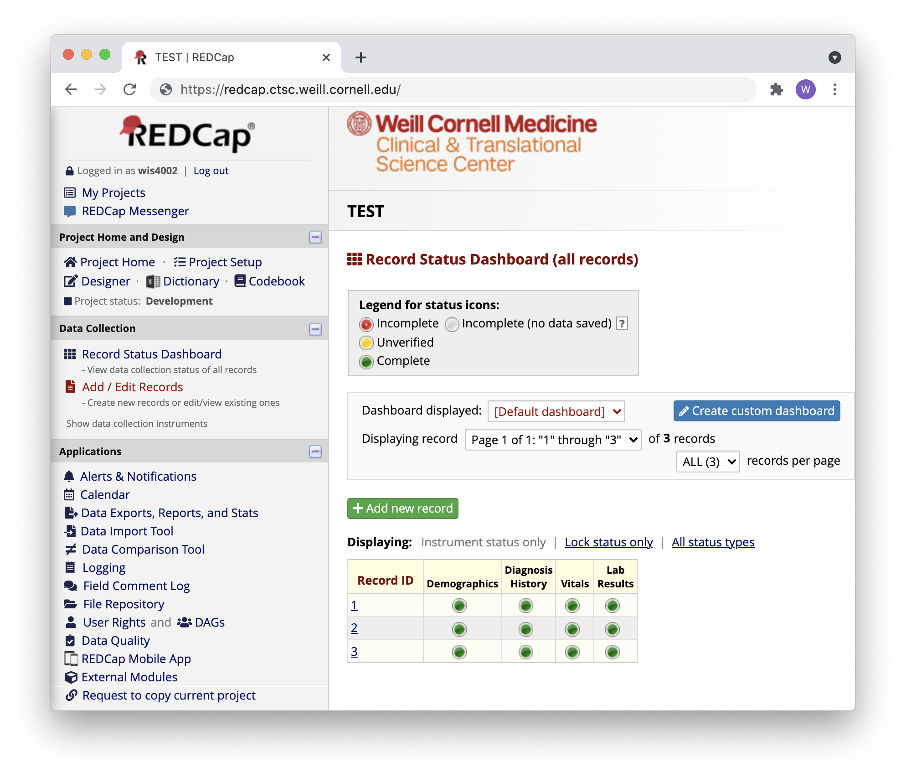

---
output:
  xaringan::moon_reader:
    css: ["styles.css", "ninjutsu"]
    seal: false
    lib_dir: libs
    nature:
      countIncrementalSlides: false
      highlightStyle: github
      highlightLines: true
      highlightSpans: true
---

```{r xaringan-extra-features, echo=FALSE}
xaringanExtra::use_tile_view()
xaringanExtra::use_search(show_icon = TRUE)
xaringanExtra::use_clipboard()
xaringanExtra::use_extra_styles(
  hover_code_line = TRUE
)
```

class: center, middle, hide-count, title
background-image: url(images/files.jpeg)
background-size: cover

<br>
<br>

.content-box-title[
  ## Reproducible .cardinal[and] modifiable?
  #### PI-facing data repositories using REDCap API and R
]

<br>
<br>
<br>
<br>
<br>
<br>
<br>

.pull-right[
  .content-box-subtitle[
    <small>Will Simmons</small> <br>
    <small>WCM Biostatistics Computing Club</small> <br>
    <small>June 29, 2021</small>
  ]
]

???

Hi everyone! Thanks for coming to our talks today - my name is Will, and I'm a Programmer Analyst in the 
Division of Biostatistics.

In this presentation, I'll talk a little about the concepts of reproducbility and modifiability, how those two
concepts are often in conflict when working with data, and how they *might* be reconciled in some very specific
but useful cases.

Then, I'll go into a detailed example using R and the REDCap API.

---

class: center, middle

### &nbsp;DATA<sub>1</sub>&nbsp; `r emo::ji("arrow_right")` &nbsp; .golden[**SCRIPT**]&nbsp; `r emo::ji("arrow_right")` &nbsp; DATA<sub>2</sub>

#### reproducible

&nbsp;

???

So -- as people who work with data, we may think of reproducibility as a way to ensure our inputs yield
the same outputs via a series of defined actions, no matter the context or who's performing the actions.
Changes to these inputs are usually not permanent but rather preserved in a separate output.

In a simple case, this takes the form of input data being modified by a script, with the output saved as new data.

---

class: center, middle

### DATA&nbsp; `r emo::ji("arrow_right")`&nbsp;&nbsp;&nbsp; .cardinal[**???**]&nbsp;&nbsp;&nbsp; `r emo::ji("arrow_right")` &nbsp; DATA

#### modifiable

&nbsp;

???

In most cases, modifiability conflicts with reproducibility. How can an output or process be reproducible 
if we can irreversibly modify it?

We've all come across common ways to modify data:

---

class: center, middle

### DATA&nbsp; `r emo::ji("arrow_right")` &nbsp; .cardinal[**EXCEL**]&nbsp; `r emo::ji("arrow_right")` &nbsp; DATA

#### modifiable

&nbsp;

???

Maybe the most infamous is just directly editing an Excel spreadsheet.

---

class: center, middle

### DATA&nbsp; `r emo::ji("arrow_right")` &nbsp; .cardinal[**EXCEL**]&nbsp; `r emo::ji("arrow_right")` &nbsp; DATA

#### modifiable

`r emo::ji("scream")` `r emo::ji("scream")` `r emo::ji("scream")`

???

At best, this can be frustrating; and, if we're not careful, we can end up with unpredicted changes or errors in our analyses.

---

class: center, middle

### DATA&nbsp; `r emo::ji("arrow_right")` &nbsp; .cardinal[**RE-DOWNLOAD**]&nbsp; `r emo::ji("arrow_right")` &nbsp; DATA

#### modifiable

&nbsp;

???

Another example that's just as common is redownloading a dataset from a regularly-updated backend source 
without preserving separate versions. This changes my source data without any proof that a change 
has occurred.

---

class: center, middle

### DATA&nbsp; `r emo::ji("arrow_right")` &nbsp; .cardinal[**RE-DOWNLOAD**]&nbsp; `r emo::ji("arrow_right")` &nbsp; DATA

#### modifiable

`r emo::ji("grimace")` `r emo::ji("grimace")` `r emo::ji("grimace")`

???

Similarly, this can lead to code breaks, unexpected results, or even incorrect analyses.

---

background-image: url(images/tug.jpeg)
background-size: cover

<br><br><br><br><br><br><br><br><br>
.pull-left[
  .text-shadow[*REPRODUCIBILITY*]
]

<br><br>
.rightalign[
  .text-shadow[*MODIFIABILITY*]
]

<br>
.centeralign[
  .text-shadow[*YOUR DATA*]
]

.footnote[.white[Source: unsplash.com/@merittthomas]]

???

And so, it seems that we're at a standoff, right? With reproducibility and modifiability both 
tugging at our data.

However, I've been asking recently if there are scenarios where modifiability can be incorporated 
into reproducibility? Are there cases where, if I were careful, modifiability could be useful to research?

---

background-image: url(images/bffs_stick.jpeg)
background-size: cover

## .text-shadow[What if ... ?]

<br><br><br><br><br>
.pull-left[
.rightalign[
.text-shadow[*REPRODUCIBILITY*]
]
]

.pull-right[
&nbsp;&nbsp;&nbsp;&nbsp;&nbsp;&nbsp;&nbsp;&nbsp;&nbsp;&nbsp;&nbsp;&nbsp;&nbsp;&nbsp;&nbsp;&nbsp;&nbsp;&nbsp;&nbsp;&nbsp;&nbsp;&nbsp;&nbsp;&nbsp;.text-shadow[*YOUR DATA*]
<br><br><br><br>
.text-shadow[*MODIFIABILITY*]
]

.footnote[Source: instagram.com/wat.ki]

???

So, I'm basically asking -- what if?

And while I don't think I've answered this question definitively for myself, my goal today is to 
explore a **very** tentative yes to both of these questions: yes, modifiability can be incorporated
into reproducible pipelines; and yes, it can even be useful and enhance them. 

---

class: center, middle

```{r, echo = FALSE, out.width="50%"}
knitr::include_graphics(c("images/db.png",
                          "images/chart.png")
)
```

.footnote[Source: Shmidt Sergey, Egorova Valentina - Noun Project]

???

So -- here's a specific scenario I've faced several times. Data for a planed study 
are located in at least two distinct places: a backend database, and in patient charts.

In other words, I need both...

---

class: center, middle

### .golden[**Programmatically**] pulled (& cleaned) data

&nbsp;

### .magnolia[**Manually** abstracted data]

???

Programmatically pulled data, and...

---

class: center, middle

### .golden[**Programmatically**] pulled (& cleaned) data

&nbsp;

### .cardinal[**Manually**] abstracted data
  
???

Manually-abstracted data.
---

# Potential solutions

<br>
<ol>

## .magnolia[<li>Change the **SQL** data itself]</li>

## .magnolia[<li>Pull, clean, and send **CSV**]</li>

## .magnolia[<li>Pull, clean, and set up **REDCap**]</li>

</ol>&nbsp;

???

In my head, I had at least three solutions:

---

# Potential solutions

<br>
<ol>

## <li>Change the .navy[**SQL**] data itself</li>

## .magnolia[<li>Pull, clean, and send **CSV**]</li>

## .magnolia[<li>Pull, clean, and set up **REDCap**]</li>

</ol>&nbsp;

???

Potential approaches and issues/cautions with each:

  - PI could manually-abstract data to be housed in SQL backend
    - By far the most time-consuming and potentially unviable on the list
    - Good long-term, but many parties involved, and what if only needed for small subset of patients?
    - Also can't just change the source data whenever more data are needed

---

# Potential solutions

<br>
<ol>

## <li>Change the .navy[**SQL**] data itself</li>

## <li>Pull, clean, and send .forest[**CSV**]</li>

## .magnolia[<li>Pull, clean, and set up **REDCap**]</li>

</ol>&nbsp;

???

  - Pulling data from backend, then sending CSV to PI to manually abstract into
    - I've done this before, and it worked ... with some caveats
    - Fewer opportunities for data validation
    - Potential for formatting errors, data deletion, etc.

---

# Potential solutions

<br>

<ol>

## <li>Change the .navy[**SQL**] data itself</li>

## <li>Pull, clean, and send .forest[**CSV**]</li>

## <li>Pull, clean, and set up .cardinal[**REDCap**]</li>

</ol>&nbsp;

*among other solutions...*

???

  - R/REDCap API 
    - Spoiler alert: this ended up being by solution, at least for now
    - Instead of hashing it out now, I'm going to spend most of this presentation explaining:
      - why this seems like the best solution given the circumstances
      - Its pros and cons
      - And best practices for using this approach in research with clinical data

---


<h3 style="margin: -10px 0 0px -2px">
.cardinal[R]esearch .cardinal[E]lectronic .cardinal[D]ata .cardinal[Cap]ture
</h3>

???

First, I wanted to VERY briefly go over REDCap itself. Many of you are likely familiar with it, but I wanted to describe some of its features that are relevant to what I'll be talking about today.

REDCap is a secure web application for building and managing online databases. It's a platform that allows researchers to enter data via an easy-to-use interface.

***

--

<center></center>

???

Here's what a REDCap window looks like if you're using Cornell's REDCap portal. 

To me, REDCap excels when integrated data collection, storage, and collaboration are needed. It has a ton of features enabling data security, validation, and customization, so to me, it seems like REDCap's primary benefit over something like shared CSV files is **controlled modifiability**. 

REDCap has some special language that I'll dive into very briefly here -- most of the terms I'll use today will probably be familiar to you, but I'll mention them to be sure. 

The first is REDCap's data dictionary....

***

--

<div style="position: absolute; top: 345px; left: 250px; width:55px;height:15px;border:4px solid #BC2B35;"></div>

???

While this is a generally-used term, REDCap's dictionary contains a list of project variables as you'd expect as well as many REDCap-specific attributes. Importantly, you can't put data into a REDCap until you've specified its dictionary. 

The second are REDCap's instruments. While the data dictionary contains all of a REDCap project's fields, it also creates higher-level instruments in which data will be collected and organized....

***

--

<div style="position: absolute; top: 533px; left: 430px; width:140px;height:20px;border:4px solid #BC2B35;"></div>

???

In other words, instruments are groups of variables housed in a form -- for example, in this window, you see Demographics, Diagnosis History, Vitals, and Lab Results.

So -- as we'll see in a bit, there are at least two ways I can interact with REDCap: via this web portal, or via the REDCap API. I'm going to tell you a bit about the latter. 

---

class: center, middle

## Working with the REDCap API
### *via* .cardinal[.code[**REDCapR**]]

???

One of the main reasons I chose working with the API was that I could keep all of my work in R. I didn't need to do as much switching between the REDCap online interface and other applications, because everything can be contained in scripts -- from pulling and cleaning source data to defining database parameters and pushing data to REDCap.

And while there are some incredible packages out there to deal with APIs in R -- httr, curl, and others -- REDCapR was an easy, out-of-the-box solution to linking R and REDCap via the API.

---

class: split-two

# Workflow


.pull-left[
<ol style="line-height:62px;">

## <li> Pull</li> 

## <li> Clean</li> 

## <li> Push</li> 

## <li> Abstract</li> 

</ol>.
]

???

In using R and the REDCap API, my workflow is generally this: ....

--

.pull-right[
<ul style="list-style-type:none; line-height:80px;">
<li></li>
<li></li>
<li></li>
<li></li>
</ul>
]

???

  - Pull data from a SQL backend (often integrating other sources, as well)
    - This isn't terribly relevant here, but many of you are probably using these same backend sources, so it's more to give context to workflows that may already exist for you

---

class: split-two

# Workflow


.pull-left[
<ol style="line-height:62px;">

## <li> Pull</li> 

## <li> Clean</li> 

## <li> Push</li> 

## <li> Abstract</li> 

</ol>.
]

.pull-right[
<ul style="list-style-type:none; line-height:80px;">
<li></li>
<li></li>
<li></li>
<li></li>
</ul>
]

???

  - Clean the data in a series of R scripts

---

class: split-two

# Workflow


.pull-left[
<ol style="line-height:62px;">

## <li> Pull</li> 

## <li> Clean</li> 

## <li> Push</li> 

## <li> Abstract</li> 

</ol>.
]

.pull-right[
<ul style="list-style-type:none; line-height:80px;">
<li></li>
<li></li>
<li></li>
<li></li>
</ul>
]

???

  - Push the data to REDCap using REDCapR, the R package that helps me use the REDCap API

---

class: split-two

# Workflow


.pull-left[
<ol style="line-height:62px;">

## <li> Pull</li> 

## <li> Clean</li> 

## <li> Push</li> 

## <li> Abstract</li> 

</ol>.
]

.pull-right[
<ul style="list-style-type:none; line-height:80px;">
<li></li>
<li></li>
<li></li>
<li></li>
</ul>
]

???

  - And then allow the PI to manually-abstract whatever data needs to be added via the REDCap online interface

... but what I'm really going to focus on today is this third step ...

---

class: split-two

# Workflow


.pull-left[
<ol style="line-height:62px;">

## .grey2[<li> Pull</li>]

## .grey2[<li> Clean</li>]

## <li> Push</li> 

## .grey2[<li> Abstract</li>]

</ol>.
]

.pull-right[
<ul style="list-style-type:none; line-height:80px;">
<li></li>
<li></li>
<li></li>
<li></li>
]

???

... using the REDCapR package to ease your interactions with the REDCap API via R. 

---


???

So -- this is REDCapR. You can download it on CRAN

---

# .cardinal[.code[REDCapR]] Setup

???

It requires a tiny bit of setup as an interface between R and REDCap.

--

<br> 

## 1. Request a .cardinal[REDCap API token] 

<br>

Store your token in secure spot accessible by .code[R] (e.g. using .code[keyring]).

???

I won't go through this in too much detail, but whether you're using a new or existing REDCap database, you'll need to request an API token. This is usually a quick process but has to be done for each database.

---

# .cardinal[.code[REDCapR]] Setup

<br> 
## 2. Ensure .golden[read/write] privileges

<br>

API privileges should include **API Export** and **API Import/Update**.

???

After you've been assigned a token, you'll also need to make sure you have the proper privileges on your REDCap repository. These user privileges are also useful for protecting your data from being accidentally edited by you or others.

---

# The Basics

<h3 style="margin: -10px 0 30px -10px">
Get data from an existing .cardinal[REDCap]
</h3>

--

```{r, eval = F}

# setup ------------------------------------------------------------

library(REDCapR)

uri <- "https://redcap.ctsc.weill.cornell.edu/redcap_protocols/api/"
token <- "9A81268476645C4E5F03428B8AC3AA7B"  # not real; store elsewhere!

```

???

Even if you never use the REDCap API for anything else, it's worth getting an API token to be able to pull REDCap data using the REDCapR package.

First, assign your uri (which should be the same across Cornell REDCap repos) and token. And again, I usually store my token in a secure spot, but I'm showing it here for illustration.

---

# The Basics

<h3 style="margin: -10px 0 30px -10px">
Get data from an existing .cardinal[REDCap]
</h3>

```{r, eval = F}

# setup ------------------------------------------------------------

library(REDCapR)

uri <- "https://redcap.ctsc.weill.cornell.edu/redcap_protocols/api/"
token <- "9A81268476645C4E5F03428B8AC3AA7B"  # not real; store elsewhere!

# pull -------------------------------------------------------------

pull <- `redcap_read`(redcap_uri = uri,
                    token = token)

data <- pull$data

```

???

Next, you'll use REDCapR's redcap_read() function to pull data. It returns a variety of API-related data, but what we're really interested in is the repository data. You can pull that by subsetting the data element from the REDCap pull.

---

# The Basics

<h3 style="margin: -10px 0 30px -10px">
Get .bold[meta]data from an existing .cardinal[REDCap]
</h3>

--

```{r, eval = F}

# pull -------------------------------------------------------------

metadata <- `redcap_metadata_read`(redcap_uri = uri,
                                 token = token)

dictionary <- metadata$data

```

???

Metadata, which includes your data dictionary, is also something useful you can pull from REDCap. Just use the redcap_metadata_read function, from which you'll again subset the data element to get the dictionary. The dictionary is pulled as a dataframe that contains the field names, their types, and other useful info.

---

# The Basics

<h3 style="margin: -10px 0 30px -10px">
Pushing things to .cardinal[REDCap]: your .bold[dictionary]
</h3>

???

Pushing data to REDCap via the API requires a little bit of learning, both about REDCap formats and using an API, neither of which I was familiar with. However, if this sounds like something that could be useful in your work, it could be worthwhile to dig into it.

First, you'll need to define your data dictionary. REDCap won't accept data without a dictionary in place first, since it serves as a template for your incoming data. You can design the dictionary on the online REDCap interface or programmatically in your R pipeline. I won't cover how to do so here, but if you'll be making lots of iterative changes or defining hundreds of variables, it might be worth doing programmatically.

--

```{r, eval = F}

# dictionary -------------------------------------------------------

 `redcap_metadata_write`(ds = my_dictionary,
                       redcap_uri = uri,
                       token = token)
```

???

You can push your created dictionary via the API using the redcap_metadata_write function. Your dictionary needs to be a specifically-formatted dataframe. I won't go over the format here, but I'm happy to field any questions after the presentation or later on.

---

# The Basics

<h3 style="margin: -10px 0 30px -10px">
Pushing things to .cardinal[REDCap]: your .bold[data]
</h3>

???

Once you have a correctly-formatted dictionary established in REDCap, you can push data to REDCap using the ...

--

```{r, eval = F}
# data -------------------------------------------------------------

 `redcap_write`(ds_to_write = df,
              redcap_uri = uri,
              token = token)

```

???

redcap_write function. I spend a lot of my time querying and cleaning data from SQL backends, and this function is really useful to push that cleaned data directly to REDCap repositories.

As with dictionaries, these dataframes need to be formatted specifically, especially if you're working in a REDCap project with longitudinal data. 

---

<h1 style="margin: 60px 0 50px 0">
More Advanced
</h1>

<h3 style="margin: -10px 0 30px -10px">
Updating existing data on .cardinal[REDCap]
</h3>

???

A little more advanced is actually updating existing data on a REDCap repository. Let's say you're just pushing SQL data at this point -- no manual abstraction has occurred.  However, you realize the SQL data has been refreshed and needs to be updated.

There are several ways to accomplish this. One way I've done it is:

--

<ol>
  <li spacing="compact">&ensp; Pull existing data</li>

```{r, eval = F}

old_data <- `redcap_read`(uri, token)

```
???
  - Pull your existing data from REDCap, so that you have your current, correctly-formatted data to work from.

--
  <li>&ensp; Modify data in R pipeline (save this code!)</li>
  
```{r, eval = F}

new_data <- old_data %>% 
  mutate(new_col = ...,                         # modify dictionary
         existing_col = f(existing_col)) %>%    # no need
  add_row(...)                                  # no need

```
???
  - Modify your data using an R script. Be sure to save this code and incorporate it into your pipeline for reproducibility!
  
--
  <li>&ensp; Push new data (and dictionary, if needed)
  
```{r, eval = F}

 `redcap_write`(new_data, uri, token)

```
???
  - Then, push the edited data back to your REDCap. If you've added new columns, you'll likely need to push a new dictionary before you push new data. With new rows and modifications to existing columns, you usually don't need to push a new dictionary.

---

# More Advanced

<h3 style="margin: -10px 0 30px -10px">
More .golden[API] stuff in R (.code[httr], .code[curl])
</h3>

???

So, here's an even more advanced use-case if you really want to tinker with your REDCap database. You can do a lot of things with the REDCap API directly that REDCapR doesn't have functions for. 

--
```{r, eval = F}

# project attributes -----------------------------------------------

formData <- list("token" = token,
                  content = 'project',
                  format = 'csv',
                  returnFormat = 'json')

response <- `httr::POST`(url, body = formData, encode = "form")

result <- httr::content(response)

```

???

This code is just shown as an example, but it pulls project attributes from REDCap, which is useful for seeing whether a project is longitudinal, when it was last updated, etc. You can also edit these attributes via the API.

--

*REDCap's .cardinal[**API playground**] is helpful here!

???

REDCap also has an API playground that will walk you through different API functions and the R code needed to accomplish them. R packages httr and curl are most commonly used here.

---

# Use-cases
<br>
???
So with all of this in mind, I want to summarize a few use-cases for the functions I've mentioned.
--

### Mix programmatic and .cardinal[abstracted] data
???
The first is what I've been primarily concerned with. A PI needs to combine data from a backend server with data that can only be manually-abstracted. Instead of playing the game where we send each other a million CSV files, using R and the API increases reproducbility and reduces stress.
--

### Long-term .forest[data sharing] with a team
???
A second, simpler use-case is just long-term data sharing with a team of researchers. Especially during COVID, cohorts are being created and modified weekly; if these data are stored and updated in REDCap with a reproducible pipeline, it'll reduce the chance of merge errors -- and you'll have fewer CSV files floating around in your data folder.
--

### If nothing else: .golden[API] convenience functions!
???
And, if nothing else - you can use the API in your pipelines to pull and catalog data from your existing REDCap repositories! One neat trick is to designate which columns are PHI, then easily pull a deidentified dataset if needed.

---

# Limitations `r emo::ji("sad_but_relieved_face")`
<br>
???
As I've mentioned, you have to take a lot of caution in using this approach. 
--

### Easy to .golden[mess things up]
???
First and most importantly, it's really easy to overwrite your REDCap, whether you just mess up parts of it or the whole thing. I've started using cron, which is Linux and Mac software, to pull automatic data backups -- REDCap has some backup functionality, but most have to be done piecemeal. 
--

### Pushed vs. .forest[abstracted] data
???
Secondly -- this is a pretty important note -- once someone starts manually abstracting into the REDCap frontend, you’re stuck with the source data you've already pushed from the backend. In my experience, there's no simple way to, let's say, refresh your SQL source data after manual abstractions have occurred, since there isn't an easy way to distinguish which edits came from where. Essentially, if you pushed new SQL data from the backend, it would erase all frontend manual edits without some complex merge functions.

--

### Particular .navy[object formatting] for RC API
???
The formatting of data and metadata uploaded via REDCap's API can be somewhat tricky. The peculiarities seem trivial until you need to produce pipelines for hundreds of variables, so I just have to write, commment, and debug API code pretty carefully.
--

### .cardinal[REDCap] dev vs. prod status
???
Lastly, REDCap distinguishes between projects in development vs. in production, with the main difference being that production status makes a project harder to edit. Some REDCapR functions are limited to development projects, such as changing the dictionary. However, if proper caution is taken, my opinion is that the benefits of staying in development mode outweigh the risks, with little loss of functionality.

---

# Best .golden[(?)] practices
<br>
???
So -- some of my best practices so far! The question mark is there because I have no idea what best practices actually look like here. This has been a very iterative process, and I look forward to someone telling me a better way to approach anything I'm doing here.
--

### REDCap user rights `r emo::ji("check")`
???
As I've mentioned before, use REDCap user rights to your advantage! I change these frequently to make sure my colleagues and I aren't accidentally changing the data at a critical stage of data abstraction. 
--

### Regular (automated!) **backups** `r emo::ji("arrows_counterclockwise")`
???
As I've mentioned, too, regular backups are GREAT, even if just for peace of mind. The repositories I currently work with are pretty small, but if this seems size-prohibitive, you may want to consider using another solution like relational databases to store your data from the get-go.
--

### **Test**/**sandbox** REDCap repositories `r emo::ji("construction_worker_man")`
???
Another in the peace-of-mind category is a test REDCap repository. Before I change the dictionary or push new data to a PI-facing REDCap, I'll copy the production REDCap to a test REDCap and implement my changes there. It's super easy to request a new REDCap database for testing.
--

### Personal **helper** functions `r emo::ji("toolbox")`
???
Lastly, and I know I'm speaking to the computing club when I say this -- create helper functions on top of packages like REDCapR! Time spent writing these functions definitely pays off. 

---
class: center

### .cardinal[**tl;dr**]
<br>
# MODIFIABILITY CAN BE USEFUL!

???

So -- I hope I've been able to show you that modifiability using REDCap as one tool can actually be pretty useful in working with clinical data, and that you don't have to abandon reproducibility to do so if you use R.

More than that, I hope I've convinced you, even in a tiny way, that modifiability can be useful to scientific and clinical research ...

--

### *. . . in many cases*

???

Even with a few....

--

### *. . . with proper precautions*

???

Caveats.

---

class: center, middle

# `r emo::ji("wave")`
# questions?

???

Thanks for listening. Does anyone have any comments or questions?

