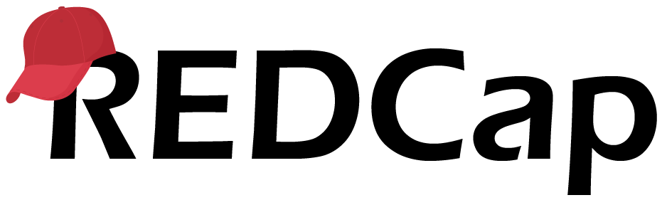

---
output:
  xaringan::moon_reader:
    css: ["styles.css", "ninjutsu"]
    seal: false
    lib_dir: libs
    nature:
      countIncrementalSlides: false
      highlightStyle: github
      highlightLines: true
      highlightSpans: true
---

```{r xaringan-extra-features, echo=FALSE}
xaringanExtra::use_tile_view()
xaringanExtra::use_search(show_icon = TRUE)
xaringanExtra::use_clipboard()
xaringanExtra::use_extra_styles(
  hover_code_line = TRUE
)
```

class: center, middle, hide-count, title
background-image: url(images/files.jpeg)
background-size: cover

<br>
<br>

.content-box-title[
  ## Reproducible .cardinal[and] modifiable?
  #### PI-facing data repositories using REDCap API and R
]

<br>
<br>
<br>
<br>
<br>
<br>
<br>

.pull-right[
  .content-box-subtitle[
    <small>Will Simmons</small> <br>
    <small>WCM Biostatistics Computing Club</small> <br>
    <small>June 29, 2021</small>
  ]
]

???

Hi everyone! Thanks for coming to our talks today - my name is Will, and I'm a Programmer Analyst in the 
Division of Biostatistics.

In this presentation, I'll talk a little about the concepts of reproducbility and modifiability, how those two
concepts are often in conflict when working with data, and how they *might* be reconciled in some very specific
but useful cases.

Then, I'll go into a detailed example using R and the REDCap API.

---

class: center, middle

### &nbsp;DATA<sub>1</sub>&nbsp; `r emo::ji("arrow_right")` &nbsp; .golden[**SCRIPT**]&nbsp; `r emo::ji("arrow_right")` &nbsp; DATA<sub>2</sub>

#### reproducible

&nbsp;

???

So -- as people who work with data, we may think of reproducibility as a way to ensure our inputs yield
the same outputs using a series of defined actions, no matter the context or who's performing the actions.
Changes to these inputs are usually not permanent but rather preserved in a separate output.

In a simple case, this takes the form of input data being modified by a script, with the output saved as new data.

---

class: center, middle

### DATA&nbsp; `r emo::ji("arrow_right")`&nbsp;&nbsp;&nbsp; .cardinal[**???**]&nbsp;&nbsp;&nbsp; `r emo::ji("arrow_right")` &nbsp; DATA

#### modifiable

&nbsp;

???

In most cases, modifiability conflicts with reproducibility. How can an output or process be reproducible 
if we can irreversibly modify it?

We've all come across common ways to modify data:

---

class: center, middle

### DATA&nbsp; `r emo::ji("arrow_right")` &nbsp; .cardinal[**EXCEL**]&nbsp; `r emo::ji("arrow_right")` &nbsp; DATA

#### modifiable

&nbsp;

???

Maybe the most infamous is just directly editing an Excel spreadsheet.

---

class: center, middle

### DATA&nbsp; `r emo::ji("arrow_right")` &nbsp; .cardinal[**EXCEL**]&nbsp; `r emo::ji("arrow_right")` &nbsp; DATA

#### modifiable

`r emo::ji("scream")` `r emo::ji("scream")` `r emo::ji("scream")`

???

At best, this can be frustrating; and, if we're not careful, we can end up with unpredicted changes or errors in our analyses.

---

class: center, middle

### DATA&nbsp; `r emo::ji("arrow_right")` &nbsp; .cardinal[**RE-DOWNLOAD**]&nbsp; `r emo::ji("arrow_right")` &nbsp; DATA

#### modifiable

&nbsp;

???

Another example that's just as common is redownloading a dataset from a regularly-updated backend source 
without preserving separate versions. This changes my source data without any proof that a change 
has occurred.

---

class: center, middle

### DATA&nbsp; `r emo::ji("arrow_right")` &nbsp; .cardinal[**RE-DOWNLOAD**]&nbsp; `r emo::ji("arrow_right")` &nbsp; DATA

#### modifiable

`r emo::ji("grimace")` `r emo::ji("grimace")` `r emo::ji("grimace")`

???

Similarly, this can lead to code breaks, unexpected results, or even incorrect analyses.

---

background-image: url(images/tug.jpeg)
background-size: cover

<br><br><br><br><br><br><br><br><br>
.pull-left[
  .text-shadow[*REPRODUCIBILITY*]
]

<br><br>
.rightalign[
  .text-shadow[*MODIFIABILITY*]
]

<br>
.centeralign[
  .text-shadow[*YOUR DATA*]
]

.footnote[.white[Source: unsplash.com/@merittthomas]]

???

And so, it seems that we're at a standoff, right? With reproducibility and modifiability both 
tugging at our data.

However, I've been exploring a few questions on this topic recently. 

Are there are scenarios where modifiability can be incorporated into reproducibility? And, are there cases where, if I were careful, modifiability could actually be useful to research?

---

background-image: url(images/bffs_stick.jpeg)
background-size: cover

## .text-shadow[What if ... ?]

<br><br><br><br><br>
.pull-left[
.rightalign[
.text-shadow[*REPRODUCIBILITY*]
]
]

.pull-right[
&nbsp;&nbsp;&nbsp;&nbsp;&nbsp;&nbsp;&nbsp;&nbsp;&nbsp;&nbsp;&nbsp;&nbsp;&nbsp;&nbsp;&nbsp;&nbsp;&nbsp;&nbsp;&nbsp;&nbsp;&nbsp;&nbsp;&nbsp;&nbsp;.text-shadow[*YOUR DATA*]
<br><br><br><br>
.text-shadow[*MODIFIABILITY*]
]

.footnote[Source: instagram.com/wat.ki]

???

So, I'm basically asking -- what if? What if reproducibility and modifiability could enhance my data and research?

And while I don't think I've answered this question definitively for myself, my goal today is to 
explore a few **very** tentative opinions that I've formed: first, that modifiability can be incorporated
into reproducible pipelines; and second, that it can even be useful to and enhance these pipelines.

---

class: center, middle

```{r, echo = FALSE, out.width="50%"}
knitr::include_graphics(c("images/db.png",
                          "images/chart.png")
)
```

.footnote[Source: Shmidt Sergey, Egorova Valentina - Noun Project]

???

So -- here's a specific scenario I've faced several times. Data for a planned study 
are located in at least two distinct places: a backend database, and in patient charts.

In other words, for this study, I need both...

---

class: center, middle

### .golden[**Programmatically**] pulled (& cleaned) data

&nbsp;

### .magnolia[**Manually** abstracted data]

???

Programmatically pulled data, and...

---

class: center, middle

### .golden[**Programmatically**] pulled (& cleaned) data

&nbsp;

### .cardinal[**Manually**] abstracted data
  
???

Manually-abstracted data.

In my head, in order to address both of these needs, there are at least ....

---

# Potential solutions

<br>
<ol>

## .magnolia[<li>Create/alter **SQL** database]</li>

## .magnolia[<li>Pull, clean, and send **CSV**]</li>

## .magnolia[<li>Pull, clean, and set up **REDCap**]</li>

</ol>&nbsp;

???

three solutions: ...

---

# Potential solutions

<br>
<ol>

## <li>Create/alter .navy[**SQL**] database</li>

## .magnolia[<li>Pull, clean, and send **CSV**]</li>

## .magnolia[<li>Pull, clean, and set up **REDCap**]</li>

</ol>&nbsp;

???

  - Investigator could manually-abstract data from patient charts to be housed in SQL backend
    - Maybe the most complex option in some senses
    - Good long-term, because we could have access to the abstracted data in a queryable database 
    - However, it may be a relatively high time commitment to build out an SQL database, especially if the data structures will be updated frequently
    - Also, not everyone knows SQL, so the data could remain inaccessible in some ways to those who don't know how to query it

---

# Potential solutions

<br>
<ol>

## <li>Create/alter .navy[**SQL**] database</li>

## <li>Pull, clean, and send .forest[**CSV**]</li>

## .magnolia[<li>Pull, clean, and set up **REDCap**]</li>

</ol>&nbsp;

???

  - I could pull data from the backend, clean it, and send a CSV to investigator into which they could manually abstract data 
    - I've done this before, and it worked ... with some caveats
    - Fewer opportunities for data validation
    - Potential for other formatting errors, data deletion, etc.

---

# Potential solutions

<br>

<ol>

## <li>Create/alter .navy[**SQL**] database</li>

## <li>Pull, clean, and send .forest[**CSV**]</li>

## <li>Pull, clean, and use .cardinal[**REDCap+R**]</li>

</ol>&nbsp;

*among other solutions...*

???

  - Third, I could use REDCap, the REDCap API, and my existing R pipelines
    - And this is actually what I'm using to address this situation for the time being, and
    - I'm going to spend most of this presentation explaining why. Specifically, I'll go over:
      - how I set up a pipeline connecting R to REDCap, 
      - why this seems like the best solution given the circumstances, and
      - some habits I've picked up in using this approach to facilitate clinical research
      
There are many good solutions here that I didn't mention, and I'd also love to hear other ways people have approached similar situations at the end of this talk.

---

class: center, middle



???

So -- before I dive into linking REDCap to R using the REDCap API, I wanted to VERY briefly go over REDCap itself.

Many of you are likely familiar with it, but I wanted to describe some of its features that are relevant to what I'll be talking about today.

---


<h3 style="margin: -10px 0 0px -2px">
.cardinal[R]esearch .cardinal[E]lectronic .cardinal[D]ata .cardinal[Cap]ture
</h3>

???


REDCap is a secure web application for building and managing online databases. It's a platform that allows researchers to enter data with an easy-to-use interface.

***

--

<center></center>

???

Here's what a REDCap window looks like if you're using Cornell's REDCap portal. It's where any collaborator can view, add, and modify study data and its attributes.

To me, REDCap really excels when a study needs integrated data collection (or abstraction), storage, and collaboration. In this way, one of REDCap's primary benefits over something like sending CSV files back and forth is **controlled modifiability**. For example, study collaborators can abstract data into a REDCap just as they would change a CSV file, but you can place constraints on when, how, and if those changes actually happen.

<!-- removed stuff about terminology here -->

So, that's a SUPER brief overview of REDCap. I'm sure there are things I'm forgetting to mention, so if anything's unclear, please feel free to interrupt me, or drop any questions in the chat and Kat can stop me. Does anyone have any questions at this moment?

***

Great. So now, there are at least two ways I can interact with REDCap: on this web portal, or using the REDCap API.

---

class: center, middle

## Working with the REDCap API
### *using* .cardinal[.code[**REDCapR**]]

???

 I'm going to tell you a bit about the latter. 

One of the main reasons I chose to work with the API was that I could keep all of my work in R. I didn't need to do as much switching between the REDCap online interface and other applications, because everything can be contained in my R scripts -- from pulling and cleaning source data to defining database parameters and pushing data to REDCap.

I'm sure many of you have used R packages that allow you to use an API -- there are a couple out there, including httr and curl. These are really flexible options, but for now, REDCapR is an easy, out-of-the-box solution to using the REDCap API in R.

---

class: split-two

# Workflow


.pull-left[
<ol style="line-height:62px;">

## <li> Pull</li> 

## <li> Clean</li> 

## <li> Push</li> 

## <li> Abstract</li> 

</ol>.
]

???

In using R and the REDCap API, my workflow is generally this: ....

--

.pull-right[
<ul style="list-style-type:none; line-height:80px;">
<li></li>
<li></li>
<li></li>
<li></li>
</ul>
]

???

  - Pull data from an SQL backend (and I often integrate other sources, as well)

---

class: split-two

# Workflow


.pull-left[
<ol style="line-height:62px;">

## <li> Pull</li> 

## <li> Clean</li> 

## <li> Push</li> 

## <li> Abstract</li> 

</ol>.
]

.pull-right[
<ul style="list-style-type:none; line-height:80px;">
<li></li>
<li></li>
<li></li>
<li></li>
</ul>
]

???

  - Clean the data in a series of R scripts

---

class: split-two

# Workflow


.pull-left[
<ol style="line-height:62px;">

## <li> Pull</li> 

## <li> Clean</li> 

## <li> Push</li> 

## <li> Abstract</li> 

</ol>.
]

.pull-right[
<ul style="list-style-type:none; line-height:80px;">
<li></li>
<li></li>
<li></li>
<li></li>
</ul>
]

???

  - Push the data to REDCap using REDCapR, the R package that helps me use the REDCap API

---

class: split-two

# Workflow


.pull-left[
<ol style="line-height:62px;">

## <li> Pull</li> 

## <li> Clean</li> 

## <li> Push</li> 

## <li> Abstract</li> 

</ol>.
]

.pull-right[
<ul style="list-style-type:none; line-height:80px;">
<li></li>
<li></li>
<li></li>
<li></li>
</ul>
]

???

  - And then I have the investigator manually abstract the data that need to be added ... using the REDCap online interface

... but what I'm really going to focus on today is this third step ...

---

class: split-two

# Workflow


.pull-left[
<ol style="line-height:62px;">

## .grey2[<li> Pull</li>]

## .grey2[<li> Clean</li>]

## <li> Push</li> 

## .grey2[<li> Abstract</li>]

</ol>.
]

.pull-right[
<ul style="list-style-type:none; line-height:80px;">
<li></li>
<li></li>
<li></li>
<li></li>
]

???

... using the REDCapR package to incorporate the REDCap API into my R pipelines. 

---


???

So -- this is REDCapR. It's available on CRAN and is pretty regularly updated.

---

# .cardinal[.code[REDCapR]] Setup

???

It requires a tiny bit of setup as an interface between R and REDCap.

--

<br> 

## 1. Request a .cardinal[REDCap API token] 

<br>

Store your token in secure spot accessible by .code[R] (e.g. using .code[keyring]).

???

I won't go through this in too much detail, but whether you're using a new or existing REDCap database, you'll need to request an API token. This is usually a quick process but has to be done for each database.

---

# .cardinal[.code[REDCapR]] Setup

<br> 
## 2. Ensure .golden[read/write] privileges

<br>

API privileges should include **API Export** and **API Import/Update**.

???

After you've been assigned a token, you'll also need to make sure you have the proper privileges on your REDCap repository. These user privileges are also useful for protecting your data from being accidentally edited by you or others.

---

# The Basics

<h3 style="margin: -10px 0 30px -10px">
Pulling `r emo::ji("arrow_down")` from REDCap: your .bold[.cardinal[data]]
</h3>

???

So -- even if you never use the REDCap API for anything else, if you have data in REDCap, it's worth getting an API token to be able to pull data directly into your R pipelines.

--

```{r, eval = F}

# setup ------------------------------------------------------------

library(REDCapR)

uri <- "https://redcap.ctsc.weill.cornell.edu/redcap_protocols/api/"
token <- "9A81268476645C4E5F03428B8AC3AA7B"  # not real; store elsewhere!

```

???

First, assign your uri (which should be the same across Cornell REDCap repos) and token. I usually store my token in a secure spot, but I'm showing an example token here for illustration.

---

# The Basics

<h3 style="margin: -10px 0 30px -10px">
Pulling `r emo::ji("arrow_down")` from REDCap: your .bold[.cardinal[data]]
</h3>

```{r, eval = F}

# setup ------------------------------------------------------------

library(REDCapR)

uri <- "https://redcap.ctsc.weill.cornell.edu/redcap_protocols/api/"
token <- "9A81268476645C4E5F03428B8AC3AA7B"  # not real; store elsewhere!

# pull -------------------------------------------------------------

pull <- `redcap_read`(redcap_uri = uri,
                    token = token)

data <- pull$data

```

???

Next, you'll use REDCapR's redcap_read() function to pull data. It returns a variety of API-related data, but what we're really interested in is the repository data. You can pull that by subsetting the data element from the REDCap pull.

---

# The Basics

<h3 style="margin: -10px 0 30px -10px">
Pulling `r emo::ji("arrow_down")` from REDCap: your .bold[.cardinal[dictionary]]
</h3>

???

Metadata, which includes your data dictionary, is also something useful you can pull from REDCap. 

--

```{r, eval = F}

# pull -------------------------------------------------------------

metadata <- `redcap_metadata_read`(redcap_uri = uri,
                                 token = token)

dictionary <- metadata$data

```

???

Just use the redcap_metadata_read function, from which you'll again subset the data element to get the dictionary. The dictionary is pulled as a dataframe that contains the field names, their column types, and other useful info.

---

# The Basics

<h3 style="margin: -10px 0 30px -10px">
Pushing `r emo::ji("weight")` to REDCap: your .bold[.cardinal[dictionary]]
</h3>

???

Pushing data to REDCap using the API requires a little bit of learning, both about REDCap formats and using an API, neither of which I was familiar with. However, if this sounds like something that could be useful in your work, it could be worthwhile to dig into it.

First, you'll need to define your data dictionary. REDCap won't accept data without a dictionary in place first, since it serves as a template for your incoming data. You can design the dictionary on the online REDCap interface or programmatically in your R pipeline. I won't cover how to do so here, but if you'll be making lots of iterative changes or defining hundreds of variables, it might be worth doing programmatically.

--

```{r, eval = F}

# dictionary -------------------------------------------------------

 `redcap_metadata_write`(ds = my_dictionary,
                       redcap_uri = uri,
                       token = token)
```

???

You can push your created dictionary through the API using the redcap_metadata_write function. Your dictionary needs to be a specifically-formatted dataframe. I won't go over the format here, but I'm happy to field any questions after the presentation or later on.

---

# The Basics

<h3 style="margin: -10px 0 30px -10px">
Pushing `r emo::ji("weight")` to REDCap: your .bold[.cardinal[data]]
</h3>

???

Once you have a correctly-formatted dictionary established in REDCap, you can push data to REDCap using the ...

--

```{r, eval = F}
# data -------------------------------------------------------------

 `redcap_write`(ds_to_write = df,
              redcap_uri = uri,
              token = token)

```

???

redcap_write function. I spend a lot of my time querying and cleaning data from SQL backends, and this function is really useful to push that cleaned data directly to REDCap repositories.

As with dictionaries, these dataframes need to be formatted specifically, especially if you're working in a REDCap project with longitudinal data. 

---

<h1 style="margin: 60px 0 50px 0">
More Advanced
</h1>

<h3 style="margin: -10px 0 30px -10px">
.cardinal[.bold[Updating data]] on REDCap
</h3>

???

A little more advanced is actually updating existing data on a REDCap repository. Let's say you're just pushing SQL data at this point -- no manual abstraction has occurred.  However, you realize the SQL data has been refreshed on the backend and needs to be updated in your REDCap repository.

There are several ways to accomplish this. One way I've done it is:

--

<ol>
  <li spacing="compact">&ensp; Pull existing data</li>

```{r, eval = F}

old_data <- `redcap_read`(uri, token)

```
???
  - Pull your existing data from REDCap, so that you have your current, correctly-formatted data to work from as a dataframe in R.

--
  <li>&ensp; Modify data in R pipeline (save this code!)</li>
  
```{r, eval = F}

new_data <- old_data %>% 
  mutate(new_col = ...,                         # modify dictionary
         existing_col = f(existing_col)) %>%    # no need
  add_row(...)                                  # no need

```
???
  - Modify your data using an R script. Be sure to save this code and incorporate it into your pipeline for reproducibility!
  
--
  <li>&ensp; Push new data (and dictionary, if needed)
  
```{r, eval = F}

 `redcap_write`(new_data, uri, token)

```
???
  - Then, push the edited data back to your REDCap. If you've added new columns, you'll likely need to push a new dictionary before you push new data. With new rows and modifications to existing columns, you usually don't need to push a new dictionary.

---

# More Advanced

<h3 style="margin: -10px 0 30px -10px">
More .bold[.golden[API]] stuff in R (.code[httr], .code[curl])
</h3>

???

So, here's an even more advanced use-case that steps outside the REDCapR package. You can actually do a lot of things with the REDCap API directly that REDCapR doesn't have functions for. 

--
```{r, eval = F}

# project attributes -----------------------------------------------

formData <- list("token" = token,
                  content = 'project',
                  format = 'csv',
                  returnFormat = 'json')

response <- `httr::POST`(url, body = formData, encode = "form")

result <- httr::content(response)

```

???

This code is just shown as an example, but it pulls project attributes from your REDCap repository, which is useful for seeing whether a project is longitudinal, when it was last updated, and other details. Similar to the REDCapR functions we saw earlier, you can pull these attributes and push changes to them using the API.

--

*REDCap's .cardinal[**API playground**] is helpful here!

???

A side note here: REDCap has an API playground that will actually walk you through different API functions and the R code needed for them. 

---

# .navy[.code[R]] + .cardinal[REDCap] API:

<h3 style="margin: -10px 0 30px -10px">
.bold[Use-cases]
</h3>

<br>
???
So with all of this in mind, I want to summarize a few use-cases for the functions I've mentioned.
--

### .cardinal[.bold[Mix]] programmatic and abstracted data
???
The first is what I've been primarily concerned with. An investigator needs to combine data from a backend server with data that can only be manually-abstracted. Instead of playing the game where we send each other a million CSV files, using R and the API increases reproducbility and reduces stress.
--

### Long-term .forest[.bold[data sharing]] with a team
???
A second, simpler use-case is just long-term data sharing with a team of researchers. Especially during COVID, cohorts are being created and modified weekly; if these data are stored and updated in REDCap with a reproducible pipeline, everyone will be able to access data centrally, and you won't have to reconcile multple CSV files floating around in your data folder.
--

### If nothing else: .bold[.golden[API]] convenience functions!
???
And, if nothing else - you can use the API in your pipelines to pull and catalog data from your existing REDCap repositories! 

---

# Limitations `r emo::ji("sad_but_relieved_face")`
<br>
???
As I've mentioned, you have to take a lot of caution in using this approach. 
--

### Easy to .bold[.golden[mess things up]]
???
First and most importantly, it's really easy to overwrite your REDCap, whether you just mess up parts of it or the whole thing. So, before I make **any** changes -- before I change the dictionary or push new data to REDCap -- I'll copy the contents of our study's REDCap to a test repository, and I'll implement my changes there. It's super easy to request a new REDCap database for testing, and it gives me a lot of peace of mind.

I should also mention, I've incorporated automatic data backups into my pipelines. You can use cron, which is software included on Linux and Mac, or Windows Task Scheduler, to pull and save data regularly. 
--

### Pushed vs. abstracted data - .forest[.bold[conflicts]]
???
Secondly -- this is a pretty important note -- once someone starts manually abstracting into the REDCap frontend, you’re stuck with the source data you've already pushed from the backend. In my experience, there's no simple way to, let's say, refresh your SQL source data after manual abstractions have occurred, since there isn't an easy way to distinguish which edits came from where. 

--

### Particular .bold[.navy[formatting]] for API pushes
???
The formatting of data and metadata uploaded using REDCap's API can be somewhat tricky. The peculiarities seem trivial until you need to create pipelines for hundreds of variables. So, when I create these objects, I just have to write, commment, and debug my code pretty carefully.
--

### REDCap .bold[.cardinal[dev vs. prod]] status
???
Lastly -- more of a note than a limitation -- but REDCap distinguishes between projects in development vs. in production, with the main difference being that production status makes a project harder to edit. The limitation here is that some REDCapR functions (like altering the data dictionary) are limited to development projects, and because of this, I usually leave my projects in development. In my opinion, if proper precautions are taken, the benefits of staying in development mode outweigh the risks, with little loss of functionality.

---

class: center

### .cardinal[**tl;dr**]
<br>

<h2>
 `r emo::ji("handshake")`  + 
</h2>

???

So -- in our brief time together, I hope I've shown you that you don't have to sacrifice the reproducibility of an R pipeline to take advantage of the modifiability of REDCap.

--

<br>
<h2>
Modifiability can be useful!
</h2>

???

And even more than that, I hope I've convinced you, even in a tiny way, that modifiability can actually be pretty useful in working with clinical data.

--

### *. . . in many cases*

???

Even with a few....

--

### *. . . with proper precautions*

???

Caveats.

---

class: center, middle

# `r emo::ji("wave")`
# questions?

???

So -- with that, thank you so much for listening. Does anyone have any comments or questions?

---

# Resources

### .code[R] packages:

  - [`REDCapR:` R utilities for interacting with REDCap](https://ouhscbbmc.github.io/REDCapR/)
  - [`redcapAPI:` R interface to REDCap](https://github.com/nutterb/redcapAPI)
  - [`httr:` a friendly http package for R](https://httr.r-lib.org/)
  - [`curl:` a modern and flexible web client for R](https://jeroen.cran.dev/curl/)

<br>

### Other resources:
 - [REDCap: Development vs. Production](https://guides.temple.edu/c.php?g=936400&p=6879981)


